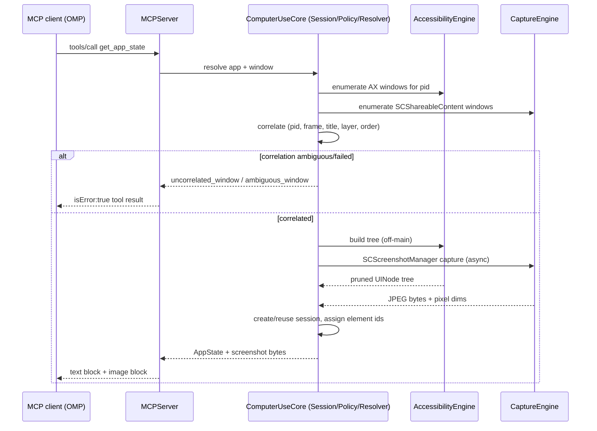
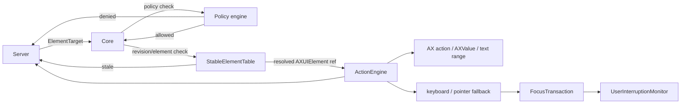

# Architecture

Normative for module boundaries, data flow, and threading. Wire details are
frozen in `PROTOCOL.md`, which wins on any conflict. Product-level usage and
setup live in [`README.md`](../README.md).

## 1. Module responsibilities

```text
Sources/
  SemantouchCLI/          executable entry point, CLI subcommand routing
  MCPServer/             stdio JSON-RPC transport, tool registry/dispatch
  ComputerUseCore/       DTOs, errors, policy, app/window resolver, session manager
  AccessibilityEngine/   AX client, tree builder/pruner, renderer, element table
  CaptureEngine/         window catalog, AX<->SCWindow correlation, capture, coords
  ActionEngine/          semantic AX actions, input fallback, focus, interruption
  CursorOverlay/         nonactivating virtual-cursor overlay
  ComputerUseFixture/    fixture app used by tests, not shipped
```

Each engine module exposes pure or narrowly-effectful types; `ComputerUseCore`
owns cross-cutting DTOs (`AppSummary`, `AppState`, `ActionResult`, error codes)
so engines do not depend on each other's internal types. `MCPServer` depends on
`ComputerUseCore` and calls into engines through `ComputerUseCore`-owned
protocols/interfaces, not directly on engine internals, so engines stay
independently testable.

No engine module writes to stdout. `MCPServer` is the only owner of the stdout
stream, and it MUST write only framed JSON-RPC messages there (PROTOCOL.md
§1). Everything else — including AX/capture diagnostics — goes to stderr.

## 2. Read-state data flow



`get_app_state` creates a session lazily (PROTOCOL.md §3) if none exists for
the resolved app. The first snapshot is full; later snapshots may return
incremental diffs with stable element ids and an advancing revision.

## 3. Action data flow



Session, revision, element-id, and policy checks (PROTOCOL.md §§3–5) MUST run
before dispatch to `ActionEngine`. `ActionEngine` never calls `MCPServer`
directly; it returns `ActionResult` up through `ComputerUseCore`.

## 4. Threading model

- **AppKit / overlay work** (`CursorOverlay`, and any `NSWorkspace`
  queries) MUST run on the main thread/run loop. `MCPServer`'s stdio read
  loop MUST NOT block the main thread if the overlay is active.
- **AX calls** (`AXUIElementCopy*`, `AXUIElementPerformAction`,
  `AXUIElementSetAttributeValue`) are synchronous and can block on the target
  app. They MUST run off the main thread, on a dedicated serial queue/executor
  per app session (PROTOCOL.md §3; ComputerUseCore `ApplicationSession`).
  This gives per-app action ordering while separate app sessions proceed
  independently.
- **ScreenCaptureKit** (`SCShareableContent`, `SCScreenshotManager`,
  `SCStream`) is async/Swift-concurrency native. Capture calls MUST use
  `async`/`await` and MUST NOT be wrapped in blocking waits on the AX queue.
- **AXObserver callbacks** arrive on the run loop where they were
  registered on. `AXObserverCoordinator` MUST register observers on a
  dedicated run loop (not the main run loop) so notification floods cannot
  starve MCP request handling, and MUST hop resulting work back onto the
  owning app's serial queue before touching `StableElementTable`.
- **MCP transport**: one reader loop parses newline-delimited stdin; each
  `tools/call` dispatches onto the appropriate app-session queue or a
  request-scoped task and replies asynchronously. Concurrent requests for
  different apps MAY execute in parallel; requests for the same app session
  MUST serialize.
- **UserInterruptionMonitor** runs a passive event tap/observer on
  its own thread and MUST be able to cancel in-flight fallback actions
  without waiting on the AX queue it is monitoring.

## 5. Session lifecycle

```text
(no session)
  --get_app_state(app)--> resolving
resolving
  --app+window resolved, correlated--> active (revision=1, full tree built)
active
  --get_app_state (same app)--> active (revision+1, full snapshot or diff)
active
  --AX notification, debounce settle--> active (next state reflects changes)
active
  --end_app_session--> ended (observers/caches released, session id retired)
active
  --process exit--> ended (implicit; no persistence across process runs)
```

- A session is keyed by resolved app identity; a session ID (`s<N>`) is
  never reused within the process lifetime (PROTOCOL.md §3).
- `end_app_session` on an unknown session id is not an error (`ended:
  false`); this MUST be idempotent.
- Element ids (`e<N>`) are scoped to one session and MUST NOT be resolved
  against a different session, even for the same app re-resolved later.
- On session end, `AccessibilityEngine` MUST drop any `AXObserver`
  registrations and `StableElementTable` entries for that session; `ActionEngine`
  MUST cancel any in-flight focus transaction or fallback action tied to it.
- Process exit MUST be treated as an implicit end for every open session;
  no session state persists across `semantouch` process restarts.

## 6. Cross-module invariants

- Only `ComputerUseCore` types cross module boundaries in public APIs; engine
  internal types (raw `AXUIElement`, `SCWindow`) stay inside their module.
- Coordinate space conversions (G/W/S, PROTOCOL.md §9) happen only in
  `CaptureEngine`/`ComputerUseCore` and are applied before any DTO leaves for
  `MCPServer`; no engine returns raw AX global points as a "frame" value.
- No module other than `MCPServer` may write to stdout.
