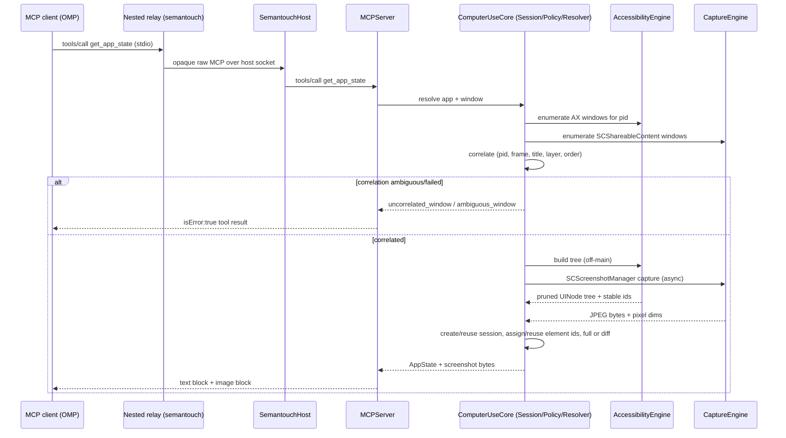
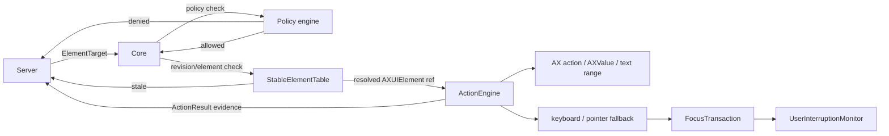

# Architecture

Normative for module boundaries, data flow, and threading. Wire details are
frozen in `PROTOCOL.md`, which wins on any conflict. Product-level usage and
setup live in [`README.md`](../README.md) and the docs under this directory.

Public computer-use support is **macOS only**. Windows/Linux GA is not claimed.

## 1. Process model (macOS reference)

```text
OMP / MCP client
    │  stdio JSON-RPC
    ▼
Contents/MacOS/semantouch          # nested relay (SemantouchCLI)
    │  private Unix-domain socket + framed hello
    │  then opaque raw MCP bytes
    ▼
Contents/MacOS/SemantouchHost      # resident app host (SemantouchApp)
    │  owns TCC, engines, sessions, overlays
    ▼
Accessibility / ScreenCaptureKit / CGEvent / AppKit
```

| Component | Product | Module path | Responsibilities |
|---|---|---|---|
| App host | `SemantouchHost` | `Sources/SemantouchApp` | Accessory NSApplication, `HostController`, onboarding UI, TCC principal |
| Nested relay | `semantouch` | `Sources/SemantouchCLI` + `SemantouchCLIKit` | Subcommands, MCP stdio relay, control client, packaging generators |
| IPC | library | `Sources/SemantouchIPC` | Socket location, peer trust, framed hello, opaque relay |
| Engines | libraries | `AccessibilityEngine`, `CaptureEngine`, `ActionEngine`, `CursorOverlay` | AX tree/diff/ids, capture/coords, actions/input, decorative cursor |
| Integration | library | `Sources/ComputerUseService` | Tool handlers, doctor, update, launch, MCPRuntime |
| Wire / DTOs | libraries | `MCPServer`, `ComputerUseCore` | JSON-RPC, ToolCatalog, schemas, errors, policy, session types |

Sources: `Package.swift`, `Sources/SemantouchCLIKit/Packaging.swift`,
`Sources/SemantouchApp/main.swift`, `Sources/SemantouchCLI/main.swift`.

### Behavioral contracts

- **TCC ownership:** host only (`Packaging.tccOwnershipDescription`).
- **No engine imports in the relay:** CLIKit depends on Core/MCP/IPC only
  (`Package.swift` `SemantouchCLIKit` target).
- **Fresh context per MCP connection:** HostController/MCPRuntime create a new
  `ServiceContext` so revisions and element ids never cross peers or restarts.
- **Stdout discipline:** MCP path writes only framed JSON-RPC to stdout
  (PROTOCOL.md §1). Relay after hello is byte-transparent (`OpaqueRelay`).

## 2. Module responsibilities (engines)

```text
Sources/
  SemantouchApp/          SemantouchHost entry, HostController, onboarding
  SemantouchCLI/          nested relay CLI entry + subcommand routing
  SemantouchCLIKit/       packaging constants, call transport, CLI helpers
  SemantouchIPC/          private host↔relay protocol (no engines, no TCC)
  MCPServer/              stdio JSON-RPC transport, tool registry/dispatch, ToolCatalog
  ComputerUseCore/        DTOs, errors, policy, app resolver, session types
  ComputerUseService/     tool handlers, doctor, update, launch, MCPRuntime
  AccessibilityEngine/    AX client, tree builder/pruner, renderer, stable ids, diff
  CaptureEngine/          window catalog, AX↔SCWindow correlation, capture, coords
  ActionEngine/           semantic AX actions, input fallback, focus, interruption
  CursorOverlay/          nonactivating virtual-cursor overlay
  ComputerUseFixture/     fixture app used by tests, not shipped
```

Each engine module exposes pure or narrowly-effectful types; `ComputerUseCore`
owns cross-cutting DTOs (`AppSummary`, `AppState`, `ActionResult`, error codes)
so engines do not depend on each other's internal types. `MCPServer` depends on
`ComputerUseCore` and is wired to engines through `ComputerUseService` handlers,
so engines stay independently testable.

No engine module writes to stdout. `MCPServer` is the only owner of the MCP
stdout stream, and it MUST write only framed JSON-RPC messages there (PROTOCOL.md
§1). Everything else — including AX/capture diagnostics — goes to stderr.

## 3. Read-state data flow



`get_app_state` creates a session lazily (PROTOCOL.md §3) if none exists for
the resolved app. The first snapshot is full; later snapshots may return
incremental diffs with stable element ids and an advancing revision
(`Sources/AccessibilityEngine/StableElementTable.swift`,
`Sources/AccessibilityEngine/AXTreeDiff.swift`).

`screenshot` captures without rebuilding the tree and **does not** advance the
revision. `read_text` resolves one revision-checked element and returns its live
`AXValue` without advancing revision
(`Sources/ComputerUseService/ReadTextService.swift`).

## 4. Action data flow



Session, revision, element-id, and policy checks (PROTOCOL.md §§3–5) MUST run
before dispatch to `ActionEngine`. `ActionEngine` never calls `MCPServer`
directly; it returns `ActionResult` up through `ComputerUseService`
(`status`, `method`, `stateChanged`, `refreshRecommended`, optional focus/
target evidence — `Sources/ComputerUseCore/DTOs.swift`).

`launch_app` is an explicit lifecycle path outside ordinary resolution
(`Sources/ComputerUseService/AppLauncher.swift`); `list_apps` never launches.

## 5. Threading model

- **AppKit / overlay work** (`CursorOverlay`, host onboarding UI, and any
  `NSWorkspace` queries that require AppKit) MUST run on the main thread/run
  loop. Hosted MCP connections may run the read loop off-main while
  `NSApplication` drains the main run loop (`MCPRuntime` hosted shape).
- **AX calls** (`AXUIElementCopy*`, `AXUIElementPerformAction`,
  `AXUIElementSetAttributeValue`) are synchronous and can block on the target
  app. They MUST run off the main thread, on a dedicated serial queue/executor
  per app session (PROTOCOL.md §3). This gives per-app action ordering while
  separate app sessions proceed independently.
- **ScreenCaptureKit** (`SCShareableContent`, `SCScreenshotManager`,
  `SCStream`) is async/Swift-concurrency native. Capture calls MUST use
  `async`/`await` and MUST NOT be wrapped in blocking waits on the AX queue.
- **AXObserver callbacks** arrive on the run loop where they were
  registered on. `AXObserverCoordinator` MUST register observers on a
  dedicated run loop (not the main run loop) so notification floods cannot
  starve MCP request handling, and MUST hop resulting work back onto the
  owning app's serial queue before touching `StableElementTable`.
- **MCP transport**: one reader loop parses newline-delimited input; each
  `tools/call` dispatches onto the appropriate app-session queue or a
  request-scoped task and replies asynchronously. Concurrent requests for
  different apps MAY execute in parallel; requests for the same app session
  MUST serialize. Hosted physical-input-capable MCP runtimes are additionally
  serialized across clients (`HostController` physical-input queue).
- **UserInterruptionMonitor** runs a passive event tap/observer on
  its own thread and MUST be able to cancel in-flight fallback actions
  without waiting on the AX queue it is monitoring.
- **IPC accept loop** runs on a dedicated thread inside `HostController`;
  production peer trust has no environment bypass.

## 6. Session lifecycle

```text
(no session)
  --get_app_state(app)--> resolving
resolving
  --app+window resolved, correlated--> active (revision=1, full tree built)
active
  --get_app_state (same app)--> active (revision+1, full snapshot or diff)
active
  --screenshot / read_text / wait_for--> active (revision unchanged)
active
  --AX notification, debounce settle--> active (next state reflects changes)
active
  --end_app_session--> ended (observers/caches released, session id retired)
active
  --process exit / host restart--> ended (implicit; no persistence across process runs)
```

- A session is keyed by resolved app identity; a session ID (`s<N>`) is
  never reused within the process lifetime (PROTOCOL.md §3).
- `end_app_session` on an unknown session id is not an error (`ended:
  false`); this MUST be idempotent.
- Element ids (`e<N>`) are scoped to one session and MUST NOT be resolved
  against a different session, even for the same app re-resolved later.
- On session end, `AccessibilityEngine` MUST drop any `AXObserver`
  registrations and `StableElementTable` entries for that session; `ActionEngine`
  MUST cancel any in-flight focus transaction or fallback action tied to it.
- Process exit / host restart MUST be treated as an implicit end for every open
  session; no session state persists across `SemantouchHost` restarts
  (`HostController` bootId is process-local).

## 7. Tool surface source of truth

`Sources/MCPServer/ToolCatalog.swift` is the single enablement table. Current
build enables **16** tools (all `enabledNow: true`), mirrored into the packaging
manifest via `ToolCatalog.enabled` (`Packaging.manifest`). Wire schemas live in
`Sources/MCPServer/ToolSchemas.swift`. Handlers live in
`Sources/ComputerUseService/ToolHandlers.swift`.

## 8. Cross-module invariants

- Only `ComputerUseCore` types cross engine module boundaries in public APIs;
  engine internal types (raw `AXUIElement`, `SCWindow`) stay inside their module.
- Coordinate space conversions (G/W/S, PROTOCOL.md §9) happen only in
  `CaptureEngine`/`ComputerUseCore` and are applied before any DTO leaves for
  `MCPServer`; no engine returns raw AX global points as a "frame" value.
- No module other than the MCP server path may write framed protocol traffic to
  stdout.
- Nested relay never holds TCC and never imports engine modules.
- Fail closed on trust, policy, revision, and permission gates — never guess a
  window, element, or grant.
