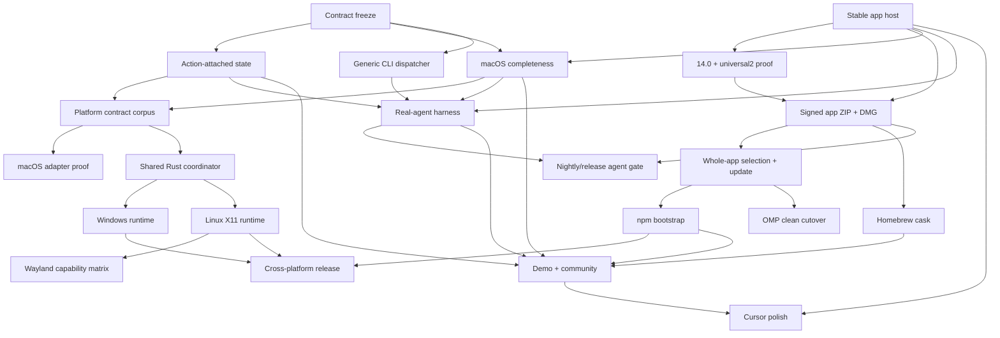

# Competitive analysis: Semantouch vs open-computer-use

**Date:** 2026-07-14
**Semantouch version:** v0.2.1 (main @ 4cef2bf)
**Comparison target:** [iFurySt/open-codex-computer-use](https://github.com/iFurySt/open-codex-computer-use) ("OCU"), v0.2.0, last commit 2026-07-10
**Method:** Direct code reading of both repositories (OCU shallow-cloned and inspected file-by-file), plus two exploration passes. Every load-bearing claim below was verified against source, with file references. OCU paths are relative to their repo root.

**Scope note:** Built-in support for other harnesses (Codex/Claude Code/Gemini/opencode installers) is excluded from the gap list — already planned. npm distribution and `.app` packaging are treated as separate items because they matter independently of harness installers.

---

## Executive summary

Semantouch has the better **protocol and engineering**: revision-checked stable element IDs, incremental tree diffs with fingerprint-based ID reuse, `wait_for`, multi-window targeting, honest focus/interruption reporting, signed/notarized supply chain, and 540 permission-free tests with zero stubs or TODOs.

OCU has the better **product experience**: it launches apps on demand, returns fresh state (tree + screenshot) after every action, installs with one npm command, keeps TCC grants across updates via a stable `.app` identity, delivers input to background apps without stealing focus, and runs on macOS + Linux + Windows with a unified 9-tool surface.

**Where we fall short is capability breadth and friction, not quality.** The single highest-leverage fix is `.app` + socket-proxy packaging, which closes three gaps at once (see Recommendations).

---

## Project overviews

### Semantouch (ours)

Swift, dependency-free, macOS 14.4+ / Apple Silicon only. Stdio MCP server + CLI (`mcp`, `doctor`, `update`, `list-apps`, `config`, `probe`). 14 MCP tools. ScreenCaptureKit per-window capture (including occluded windows), compact AX trees with stable element IDs, full-snapshot-then-diff model, semantic-first actions with guarded coordinate/keyboard fallback, interference policy, user-interruption detection, non-activating virtual cursor overlay. Distributed as an OMP plugin downloading a Developer ID-signed, notarized, checksum-verified bare binary to a **versioned** path.

### open-computer-use (theirs)

Swift core (`packages/OpenComputerUseKit`, ~9,350 lines) + Go/Python Linux runtime (AT-SPI) + Go/PowerShell Windows runtime (UIA). 9 MCP tools, identical surface across all three platforms. npm-distributed (`npm i -g open-computer-use`, `ocu` alias), macOS 14.0+. Ships an `Open Computer Use.app`; the CLI relays automation to the `.app` process over a Unix domain socket so all TCC-relevant work runs under one stable identity. Inspired by OpenAI's Codex Computer Use; includes a reverse-engineered "Cursor Motion" model of the official cursor animation. Built with an AI-first "harness template" workflow; bilingual docs; MIT.

Their tool list: `click`, `drag`, `get_app_state`, `list_apps`, `perform_secondary_action`, `press_key`, `scroll`, `set_value`, `type_text` (`ToolDefinitions.swift`). No `doctor` (CLI-only), no `screenshot`-only tool, no `wait_for`, no `select_text`, no session end.

---

## Where Semantouch falls short

### 1. The observe→act loop costs two round trips ⭐

Every OCU mutating tool ends with `snapshotResult(for: try refreshSnapshot(...), style: .actionResult)` — a fresh tree render **plus screenshot** returned inline (their `ComputerUseService.swift:1692`). Semantouch actions return a small `ActionResult` JSON and the model must call `get_app_state` again (`Sources/ComputerUseService/ToolHandlers.swift:211`).

We already have the diff infrastructure. Attaching a tree **diff** (and optionally a screenshot) to action results would beat OCU on both latency *and* tokens — they resend the full tree + full PNG every action.

Note their wart: per-call tree budgets (`max_tree_nodes` etc.) don't cascade into action-refresh results, which always use defaults. Ours should cascade.

### 2. Cannot launch apps ⭐

OCU launches a not-running app on demand during app resolution via `NSWorkspace.openApplication` (`AppDiscovery.swift:252–273`), guarded by a password-manager blocklist. Their `list_apps` merges running apps with Spotlight-indexed apps used in the last 14 days (`kMDItemUseCount`, `kMDItemLastUsedDate` ranking), sorted by recency/frequency.

Semantouch's `AppLister` shows installed apps (`isRunning: false, windows: 0`) but there is **no way to start one** — "open TextEdit and write a note" dead-ends immediately. Our no-launch stance is documented as intentional (SECURITY.md), but it is a major practical gap. If kept intentional, it needs an explicit `launch`-style opt-in path rather than a dead end.

They also have a window-recovery ladder when an app has no visible window: unhide → activate → `open -b` → `AXRaise` with 0.7 s retry. We resolve windows but never recover a hidden/minimized app.

### 3. Focus-escalation modes are non-functional in practice (Stage J Finding B) ⭐

Our own live trials (macOS 26, Stage J): `allow-brief-focus` / `foreground-takeover` cannot foreground a background app **from the MCP server process** — 0/10 trials (5/5 from a plain CLI; OS constraint on background helpers, not a code bug). Fails safe (`status: rejected`, nothing delivered), but in practice our fallback input only delivers when the target is **already frontmost**.

OCU sidesteps this entirely: pointer/keyboard events are posted with `postToPid` (`InputSimulation.swift`), landing in **unfocused** apps without moving focus; the global HID path is opt-in via `OPEN_COMPUTER_USE_ALLOW_GLOBAL_POINTER_FALLBACKS=1`. So for apps with weak AX-action support, they deliver where we return `focus_required` — and we can't even escalate.

Our own Stage J notes identify `.app` packaging as the likely unblock. (Caveat: pid-posted events are flakier in some apps; our interference policy and `targetVerified` honesty are worth keeping regardless of delivery mechanism.)

### 4. TCC permission churn across releases ⭐

Versioned helper path (`~/Library/Application Support/Semantouch/<version>/semantouch`) means users may re-grant Accessibility + Screen Recording **every release** (documented in our README). OCU's `.app` holds the grants across updates, and `doctor` pops a GUI onboarding window (via an app agent) only when something is missing. Their permission check merges the TCC database view with runtime checks (`AXIsProcessTrusted()` + `CGPreflightScreenCaptureAccess()`) to avoid stale-record onboarding loops.

**The mechanism to copy is the architecture, not just the packaging:** their CLI relays all automation over a Unix domain socket to the `.app` process, so screenshots/AX/input always execute under one stable identity regardless of how the CLI was invoked or updated. This is the same work item as #3.

### 5. No double-click, no middle button

OCU `click` takes `click_count` and `mouse_button: left|right|middle`. Our button schema is `["left","right"]` with no count (`Sources/MCPServer/ToolSchemas.swift:282`), and there is no double-click path anywhere in the codebase — double-click-to-open in Finder, double-click-to-select-word, etc. are impossible unless the app exposes an equivalent AX action.

### 6. No way to read long text

We enforce a hard 256-byte per-field cap (`Sources/AccessibilityEngine/AccessibilityEngine.swift:21`, PROTOCOL §7.5) with no escape hatch. OCU's `get_app_state` takes `text_limit` up to `"max"` specifically for chat histories, email bodies, and documents — their skill instructs agents to use it. Reading a long document through our tree is currently not possible. Needs a `text_limit`-style knob or a dedicated `read_text` tool (e.g. full `AXValue` of one element).

### 7. Coordinate clicks never get semantic reliability

Given a pixel coordinate, OCU hit-tests AX element candidates at that point and attempts a semantic press **first**, falling back to synthesized input only if that fails (`ComputerUseService.swift:435–470`). Our coordinate path deliberately "never auto-escalates" and goes straight to synthesized pointer input. For vision-driven targeting (model picks a point off the screenshot), they convert it into a semantic action; we don't.

Related reliability scar tissue they've accumulated for Electron/chat apps that we lack:
- Synthetic text rows clicked at a **left-side safe anchor** instead of center, to avoid trailing "done"/checkbox side-actions (tuned on Lark/Feishu rows).
- Clicking summary text walks up to the parent row's `AXPress`.
- Coordinate hit-tests that land on giant containers stop descendant-scanning so far-away clickables can't hijack the click.

### 8. `type_text` lacks a background-safe rich-text fallback

If the focused element's `AXValue` is settable, OCU appends and writes back instead of synthesizing key events — typing that works in background Electron apps. Our `type_text` is pure key events (`set_value` exists as a separate tool, but the model must think to use it). Grapheme handling is parity: we type per Swift `Character` (an extended grapheme cluster) with interruption checks between each (`Sources/ActionEngine/KeyboardActions.swift:225`) — finer-grained interruption than their 64-UTF-16-unit chunks, slightly slower on long text.

### 9. Missing MCP protocol niceties

- **No tool `annotations`** (`readOnlyHint`, `destructiveHint`, `idempotentHint`, `openWorldHint`). Our descriptor is only `name/description/inputSchema` (`Sources/MCPServer/ToolRegistry.swift:72`). Clients use annotations for permission UX / auto-approval decisions.
- **No `instructions` field in `initialize`.** OCU ships long-form model guidance in the handshake, which travels to *any* MCP client. Our usage discipline lives in the OMP skill, which doesn't travel — this directly matters for the planned harness-agnostic future.
- **No turn-boundary hook.** OCU handles `notifications/turn-ended` to clear the cursor overlay at agent turn boundaries.

### 10. Distribution friction

`npm i -g open-computer-use` works with any MCP client immediately. We require OMP or a source build. An npm (and/or Homebrew) package of the signed helper would widen the funnel independently of harness installers.

### 11. No generic CLI tool-call interface

`ocu call <tool> --args '{...}'` and `ocu call --calls '[...]'` (sequences sharing element-index state in one process, tunable inter-call sleep) enable debugging, scripting, and skill-driven use without an MCP client. We have `probe`/`list-apps`/`doctor` but no way to exercise arbitrary tools from the shell.

### 12. Softer default safety posture on one axis

OCU hard-blocks password managers by default — 1Password, Bitwarden, Dashlane, LastPass, NordPass, Proton Pass (`AppDiscovery.swift:507`). Our denylist is empty by default (documented, deliberate — but "agent can read your password manager unless the operator configured a denylist" is the worse default). A built-in default-deny set with an operator override would be strictly better.

### 13. Smaller gaps

- **Cursor polish:** their overlay follows a 1,500-line reverse-engineered model of the official Codex cursor — heading-driven path candidates (direct/turn/brake/orbit), Verlet spring integration at 240 Hz, calibrated 1.43 s travel, per-click-type pulse; persists across calls with 30 s idle cleanup; cleared on turn-end. Ours is exponential ease + ripple with per-session identity color. Cosmetic, but it's what demos show. They also ship a standalone Cursor Motion app as a marketing artifact.
- **Key syntax:** they accept xdotool syntax (`super+c`, `KP_0`, `Page_Up`) — models have strong priors on it from CUA training data. Our chord grammar (`cmd+shift+a`, space-separated chords) is clean but proprietary. Consider accepting xdotool aliases.
- **Agent-in-the-loop testing:** they script E2E smoke tests driving real agents (claude, codex, hermes with pluggable provider/model) against their fixture app, plus stress loops and a permission-onboarding E2E (`scripts/run-agent-smoke-tests.mjs`). Our offline/protocol/fixture testing is stronger than theirs, but nothing exercises the full model loop.
- **Platform floor:** macOS 14.4+ / arm64 only vs their 14.0+ (Intel Macs excluded from ours).
- **Screenshot degradation:** their 5 s ScreenCaptureKit timeout omits the image block and still returns the tree instead of failing the call. Worth borrowing.
- **Scroll:** they support fractional page counts; we do integer `line|page` counts. Minor.
- **Community surface:** bilingual README, demo videos, DeepWiki badge, star-history. Soft, but part of "better."

---

## Where Semantouch is ahead (protect these)

1. **Correctness under staleness.** Their element indices are bare ints into a cached snapshot with **zero staleness checking** (`ComputerUseService.swift:683`) — a stale index silently clicks whatever occupies it now. Our revision-checked `stale_revision`/`stale_element` contract rejects instead of guessing.
2. **Token efficiency.** Incremental diffs with structural-fingerprint ID reuse (`Sources/AccessibilityEngine/AXTreeDiff.swift`, `StableElementTable.swift`) vs their full tree + full PNG on every action.
3. **`wait_for`** (title/url/element conditions, `all|any`, deadline-as-result) — they have nothing; agents must re-snapshot and eyeball. Plus the cheap `screenshot` primitive that doesn't advance the revision.
4. **Multi-window targeting.** `windowId`, `windows[]`, `scopeElementId` scoped re-walks, web-area URL/document extraction. They only see the focused window, with recovery hacks. Our window correlation is tested across 32 scenarios and returns a typed `ambiguous_window` error rather than an approximate pick.
5. **Input integrity.** User-interruption detection mid-synthesis (`status: "interrupted"`), `targetVerified`/`focusChanged`/`focusRestored` honesty, per-session FIFO action lanes, modifier-release safeguards (Stage J Finding D). They scatter `Thread.sleep(0.1–0.25)` and hope.
6. **Settle discipline.** Debounced AX-notification settle detector (75 ms debounce / 150 ms quiet / 1 s cap) vs fixed sleeps.
7. **Supply chain & protocol rigor.** Signed/notarized releases, checksum-verified self-update, server-side JSON-Schema validation, frozen wire contract, cancellation checkpoints, stdout reserved for JSON-RPC. Clean-room (no private APIs, zero external dependencies).
8. **Richer semantic verbs.** `select_text`, `set_value` with `commit`, element-targeted `press_key`/`type_text` (focus the element before synthesis).
9. **Test depth.** 540 permission-free offline tests including diff-reconstruction proofs (`apply(base, diff) ≡ fresh`) and an interference decision-table matrix. No TODOs/stubs anywhere.

Parity worth knowing: both use ScreenCaptureKit (`SCScreenshotManager`) so occluded-window capture is not a differentiator; both auto-enable Chromium/Electron accessibility (`AXManualAccessibility` — ours verifies by re-read because Chromium can return `cannotComplete` while the write takes effect); both compress empty AX wrappers in Electron trees; both are grapheme-safe when typing.

---

## Prioritized recommendations

1. **`.app` + socket-proxy packaging.** One work item, three gaps: unblocks brief-focus/foreground modes (Finding B), ends TCC re-grants across releases, and creates a clean permission boundary. Evaluate `postToPid` delivery alongside it as a true-background fallback lane (keep the interference policy and `targetVerified` honesty on top of whichever mechanism delivers).
2. **Attach state to action results.** Return a tree diff (and optionally a screenshot) inline from mutating tools; cascade the caller's snapshot options. Halves the observe→act round trips and beats OCU's full-resend on tokens.
3. **App launching + recency.** `launch` opt-in path (respecting the denylist) + last-used/use-count data in `list_apps` (Spotlight metadata).
4. **Pointer + text-read completeness.** `clickCount` (double-click), `middle` button; a full-text read path (`text_limit`-style knob or `read_text` tool) past the 256-byte field cap.
5. **MCP surface polish (cheap, do early).** Emit tool `annotations`; send `initialize.instructions` with the usage discipline (once-per-turn, stale-ID contract, interference policy); handle `notifications/turn-ended` for the cursor overlay. Directly serves the harness-agnostic goal.
6. **Coordinate→semantic click resolution.** Hit-test AX candidates at the point, try semantic press first; add Electron-row safe-anchor heuristics.
7. **`semantouch call` CLI** with `--calls` sequences sharing session state.
8. **Default password-manager denylist** (operator-overridable).
9. **`type_text` settable-AXValue fallback**; window-recovery ladder (unhide/activate/reopen); screenshot-timeout graceful degradation; xdotool key-syntax aliases; fractional scroll pages.
10. **Agent-in-the-loop smoke harness** driving real agents against the fixture.
11. **Cursor-motion polish** (heading-driven candidates / spring dynamics) — cosmetic, demo-visible.
12. **Strategic call: cross-platform.** Their Linux (Go + AT-SPI/Python, ~2,800 lines, session-env auto-discovery, Wayland black-frame detection) and Windows (Go + UIA/PowerShell, env-gated safety defaults) runtimes are real if modest, with the same 9-tool surface everywhere. Matching this is a directional decision, not a checklist item — but it is their biggest moat.

---

## Pointers for a future session

- OCU source: clone `https://github.com/iFurySt/open-codex-computer-use`. Key files: `packages/OpenComputerUseKit/Sources/OpenComputerUseKit/{ToolDefinitions,ComputerUseService,AccessibilitySnapshot,InputSimulation,AppDiscovery,CursorMotionModel,SoftwareCursorOverlay,MCPServer}.swift`; platform runtimes in `apps/OpenComputerUseLinux` and `apps/OpenComputerUseWindows`; agent E2E in `scripts/run-agent-smoke-tests.mjs`; ops notes in `docs/RELIABILITY.md` (Chinese).
- Our side, the files this analysis leaned on: `Sources/MCPServer/{ToolSchemas,ToolRegistry}.swift`, `Sources/ComputerUseService/ToolHandlers.swift`, `Sources/ActionEngine/{CGEventSynthesizer,KeyboardActions,FocusTransaction}.swift`, `Sources/AccessibilityEngine/{AXTreeDiff,StableElementTable,AccessibilityEngine}.swift`, `docs/{USAGE,PROTOCOL,SECURITY}.md`.
- Stage J live findings (modifier-chord fix, Finding B focus limitation, restore asymmetry, modifier-release safeguard) are the empirical basis for recommendation #1.

---

## Delivery program

This section turns the comparison into an implementation program. The ordering is
intentional: first freeze the public behavior, then improve the macOS product,
then widen distribution, then add platforms without weakening the contract.

### Product decisions

1. **Keep Semantouch's stronger contract.** The target surface is the existing 14
   tools plus `launch_app` and `read_text`. Windows and Linux must implement the
   same contract; they are not allowed to ship an OCU-style nine-tool subset.
2. **Use one stable macOS app identity.** `Semantouch.app`, bundle identifier
   `tech.watzon.semantouch`, is the only process allowed to call Accessibility,
   capture, or event-delivery APIs. A separately signed nested `semantouch`
   executable remains the stdio CLI but relays bytes to the app over a private
   Unix-domain socket.
3. **Keep stdio MCP public; keep the socket private.** MCP client configuration
   remains `type: "stdio"` with args `["mcp"]`. After a private authenticated
   hello, the relay copies MCP bytes opaquely. It does not parse, retry, replay,
   cache, or re-encode requests.
4. **Attach state without copying OCU's token cost.** A successful mutating tool
   returns its normal `ActionResult` with an additive `state` object containing
   the new `AppState`; an optional screenshot remains a separate MCP image content
   block. The state prefers a reconstructable diff. Rejected actions do not
   advance revision or attach state.
5. **Cascade observation options into action refresh.** Screenshot policy, tree
   budget, force-full, disable-diff, scope, and window selection use one shared
   `SnapshotOptions` contract. Defaults match `get_app_state`.
6. **Keep the compact tree compact.** The 256-byte field cap remains the default.
   `read_text` retrieves the full value of one revision-checked element with an
   explicit caller limit; it does not raise every snapshot's token budget.
7. **Launch is explicit and policy-gated.** `launch_app` is a separate mutating
   tool, disabled only by policy—not hidden inside target resolution. The default
   denylist includes common password managers and applies before reads, launches,
   or actions. Operators can explicitly replace or override it.
8. **Use Homebrew and npm for different jobs.** A Homebrew cask installs the
   canonical signed app. npm is a thin launcher/bootstrap package that finds or
   installs the same signed app; it never carries a second TCC-owning runtime.
9. **Adopt macOS 14.0 and universal2 only after native proof.** The package already
   targets macOS 14, but public support changes only after end-to-end runs on
   actual macOS 14.0 arm64 and Intel machines.
10. **Build Windows before Linux.** Keep macOS in Swift. Use one Rust coordinator
    for Windows and Linux so revision checks, stable IDs, diffs, policy, waits,
    action evidence, and wire encoding are implemented once. Add native UIA and
    Windows Graphics Capture first, then AT-SPI/X11. Wayland remains
    compositor-capability-gated until proven.
11. **Polish the existing cursor; do not clone their side product.** Heading-based
    paths, spring dynamics, click pulses, persistence, and idle/turn cleanup belong
    in `CursorOverlay`. There is no separate Cursor Motion app.
12. **Make real-agent tests evidence-based.** Model success prose cannot pass a
    test. The harness must verify machine-readable tool events, exact fixture
    mutations, stale-ID refusal, wait outcomes, and diff reconstruction.

### Invariants that every phase must preserve

- Element actions remain bound to `sessionId`, `revision`, and `elementId`.
- Reuse requires both a matching structural fingerprint and a live native handle.
  Removed IDs are never recycled.
- Only the snapshot commit path advances revisions or updates diff bases.
- `apply(base, diff) == fresh` remains a release invariant.
- Fallback input reports the actual lane, target verification, interruption,
  focus change, and restoration. An API call with no acknowledgement is not
  reported as confirmed delivery.
- The dedicated `screenshot` tool stays tree-free and revision-free. Capture
  timeout may degrade a state/action result to tree plus warning, but a
  screenshot-only request fails with a typed error.
- Per-session action order remains FIFO. Cross-client physical input is serialized
  by the app host.
- The relay never reconnects or replays after a host failure. EOF creates a new
  session and a new boot epoch.
- Release artifacts retain exact Developer ID Team `MB5789APU7`, Hardened Runtime,
  inside-out signing, notarization, stapling, checksums, and immutable publication.
- The overlay is decorative: nonactivating, permission-free, and never on the
  correctness path.

### Target public tool surface

| Tool | Change |
|---|---|
| `doctor` | App-host permission/signing/socket status; read-only annotation |
| `list_apps` | Installed + running apps, Spotlight recency/use rank |
| `launch_app` | New; explicit, denylist-gated launch with bounded window recovery |
| `get_app_state` | Shared `SnapshotOptions`; capture-timeout tree degradation |
| `screenshot` | Remains cheap and revision-free; timeout is a typed failure |
| `read_text` | New; one revision-checked element, explicit limit or `max` |
| `click` | `clickCount`, `middle`, semantic coordinate hit-test first |
| `drag` | Existing semantics; platform evidence preserved |
| `scroll` | Fractional page amounts |
| `press_key` | Existing chord grammar plus xdotool aliases |
| `type_text` | Settable `AXValue`/native value pattern before synthesized keys |
| `set_value` | Existing explicit semantic path |
| `select_text` | Existing first-class semantic path |
| `wait_for` | Existing deadline-as-result verification |
| `perform_secondary_action` | Existing semantic action |
| `end_app_session` | Existing idempotent cleanup |

Every descriptor emits MCP annotations. The initialize response carries concise
usage instructions covering observe/act cadence, stale IDs, semantic-first
targeting, interference policy, cheap screenshots, and untrusted on-screen text.
`notifications/turn-ended` clears only decorative cursor state.

### Dependency graph

### Phased implementation

#### C0 — Freeze the additive protocol

**Scope**

- Add `SnapshotOptions`, action-attached `state`, tool annotations,
  initialize instructions, turn-end notification behavior, `launch_app`,
  `read_text`, click count/button, fractional scroll, typed capture degradation,
  and capability codes to `docs/PROTOCOL.md`, DTOs, schemas, and goldens.
- Add a canonical `contracts/semantouch-1/` corpus for `tools/list`, stale
  revision, stale element, diff reconstruction, interference evidence,
  action refresh, capture degradation, wait deadline, and policy-before-dispatch.

**Gate**

- Existing clients can ignore every new response field.
- Unknown request fields still fail server-side schema validation.
- All 16 tools have one canonical descriptor and no platform aliases.

#### M0 — Stable signed app host and authenticated relay

**Scope**

- Add `SemantouchApp`, `SemantouchIPC`, and a minimal nested relay target.
- Use a per-user `AF_UNIX` stream in `_CS_DARWIN_USER_TEMP_DIR`, with a 0700
  parent, 0600 socket, same-euid check, audit token, live Security.framework
  designated-requirement validation, selected-bundle path validation, bounded
  frames, and mutual host/relay authentication.
- Keep MCP bytes raw after hello. Give every connection isolated runtime/session
  state and serialize cross-client native input.
- Add an onboarding/status window for Accessibility and Screen Recording.
- Add semantic, `postToPid`, and explicit focus-escalated lanes. Only claim
  delivery when an observable postcondition confirms it.

**Gate**

- Existing MCP contract tests pass through app → socket → relay byte-for-byte.
- Killing the host closes the relay; no retry/replay occurs.
- A pre-restart element ID cannot resolve after restart.
- Wrong UID, signing identity, Team, code identifier, path, frame, owner, mode,
  or socket type fails closed.
- Live testing shows TCC belongs only to `tech.watzon.semantouch` and survives a
  same-identity whole-app update.

#### M1 — One-round-trip action loop

**Scope**

- Refresh state only after an action commits and the session is marked dirty.
- Prefer an incremental diff and attach a screenshot only when requested.
- Cascade `SnapshotOptions`; preserve full-tree/reset behavior when lineage is
  unavailable.
- Bound capture. Return tree plus `screenshot_unavailable` on state/action
  timeout; keep cancellation distinct from timeout.

**Gate**

- An action diff reconstructs exactly to a forced fresh snapshot.
- Rejected actions do not advance revision or attach state.
- Interrupted partial input can attach state with honest unsettled warnings.
- `maxNodes`, scope, window, screenshot, force-full, and disable-diff options all
  reach the refresh pipeline.

#### M2 — macOS capability and safety completeness

**Scope**

- Add policy-gated launch, Spotlight recency ranking, and bounded
  unhide/activate/reopen/raise recovery.
- Add default password-manager protection with an explicit operator override.
- Add repeated/double and middle clicks.
- Convert coordinate clicks to bounded AX hit-test candidates; prefer semantic
  action, use a left safe anchor for synthetic rows, walk summary text to its row
  action, and never scan descendants of a giant container.
- Add element-scoped long text reads, settable-value typing, xdotool aliases, and
  fractional page scrolling.
- Add MCP annotations, initialize instructions, and turn-end cursor cleanup.

**Gate**

- Every item has a permission-free fixture or contract case.
- Launch checks policy before process creation.
- Long text reads do not lift global tree caps.
- Coordinate semantics cannot select a far-away descendant.
- Typing and pointer results report the method actually used.

#### A0–A2 — CLI and agent validation

**Scope**

- Extract one dispatcher used by MCP and `semantouch call`.
- Support one call and `--calls` sequences with shared session state and optional
  inter-call delay; fail the remaining sequence after malformed input.
- Drive isolated fixture instances with Claude and Codex; Hermes is optional.
- Run interactive smoke nightly/manually and against exact staged release bytes.

**Gate**

- CLI and MCP produce the same content/error shapes.
- Required tool calls are observed in machine-readable transcripts.
- Exact fixture state, stale-ID rejection, wait outcome, and diff reconstruction
  pass independently of model prose.
- Paid/TCC-dependent tests never run on ordinary PR jobs.

#### D0–D5 — macOS distribution and reach

**Scope**

- Prove macOS 14.0 on arm64 and Intel; build universal2 host and relay.
- Publish a signed/notarized/stapled app ZIP and DMG. Replace whole app bundles,
  never nested executables.
- Deterministically prefer `/Applications/Semantouch.app`, then
  `~/Applications/Semantouch.app`; warn on duplicates.
- Publish a thin npm bootstrap with provenance and a Homebrew cask using the same
  immutable app artifact.
- Make the OMP plugin script/config-only.

**Gate**

- Every nested Mach-O contains both slices before universal support is claimed.
- ZIP extraction and DMG pass strict signature, designated requirement,
  notarization, stapling, Gatekeeper, checksum, and quarantine tests.
- Tampered or mismatched app/relay/Team/version/architecture fails before launch.
- npm and Homebrew never mutate signed bundle contents.

#### R0–R1 — Community proof and cursor polish

**Scope**

- Add English/Chinese README parity, contribution guidance, platform issue forms,
  DeepWiki/star-history links, and a reproducible captioned demo.
- Demo launch, covered-window capture, action diffs, stale-ID rejection,
  `wait_for`, and interruption/focus evidence—not just cursor cosmetics.
- Add heading candidates, turn/brake/orbit paths, spring integration, click
  pulses, persistence, and 30-second idle cleanup to the existing overlay.

**Gate**

- Every demo claim is tied to recorded tool results and fixture events.
- Overlay remains nonactivating, never moves the real pointer, adds no permission,
  and cannot gate an action.

#### P0–P6 — Cross-platform without contract regression

**Scope**

- Define a neutral platform adapter: capabilities, app/window discovery, launch,
  raw observation with live handles, capture outcome, resolved native action,
  activity stream, and session cleanup.
- Keep session IDs, public element IDs, revisions, diff bases, policy, waits,
  lanes, and wire encoding in the coordinator—not platform drivers.
- Put current macOS engines behind the adapter with no public behavior change.
- Implement one Rust coordinator for Windows/Linux.
- Add native Windows UIA/Graphics Capture/input first; then Linux AT-SPI/X11;
  then an explicit Wayland compositor/portal matrix.
- Extend the verified release manifest/npm selector only after platform parity
  gates pass.

**Gate**

- Swift and Rust pass the same contract corpus.
- Windows and Linux expose all 16 tools with stable-ID, reconstructable-diff,
  wait, policy, and interference guarantees.
- A capture/input limitation is a typed capability result, never a black image or
  false success.
- Windows GA requires Authenticode, checksums, provenance, x64 + arm64, and an
  interactive fixture pass.
- Linux GA names supported desktops/sessions, verifies x64 + arm64 artifacts,
  and keeps Wayland separately capability-gated.

**Implemented foundation (not GA)**

- `runtime/**` now contains one 16-tool Rust coordinator plus native Windows
  UIA and Linux AT-SPI adapters. Shared behavior covers sessions, revisions,
  stable IDs, reconstructable diffs, policy, waits, action evidence, scoped
  snapshots, typed capabilities, and MCP stdio framing.
- Windows and Linux target checks pass for
  `x86_64-pc-windows-msvc` and `x86_64-unknown-linux-gnu`; the Swift/Rust
  enabled tool catalogs match exactly in name and order.
- Live interactive Windows/Linux fixture runs, Windows Graphics Capture,
  signed platform artifacts, and the named Wayland compositor matrix remain
  release gates. Target compilation is not presented as live-platform proof.

### Parallel execution rules

- C0 is serial because every implementation consumes its wire decisions.
- After C0, M0, M1, M2, and A0 may run in parallel only with disjoint file
  ownership. `ToolHandlers.swift`, `ToolSchemas.swift`, and protocol goldens each
  have one owner at a time.
- D0 waits for M0; D1 waits for D0; D2–D5 fan out after the signed app exists.
- A1 waits for A0, M0, M1, and M2. A2 waits for A1 and the staged app artifact.
- P1 and P2 fan out after P0. P3 and P4 fan out after P2. P5 waits for P4.
- R0 waits for working product/distribution proof. R1 waits for R0 and never
  delays correctness or release work.
- Each phase is green before dependents start: focused tests first, then the
  permission-free package suite, contract goldens, and artifact checks.

### External decision gates

These do not reduce scope; they identify evidence that cannot be fabricated.

- npm publishing needs publisher ownership and OIDC trusted-publishing setup.
- Homebrew needs a public `watzon/homebrew-tap` repository.
- The 14.0/Intel claim needs actual arm64 and Intel macOS 14.0 machines.
- TCC persistence needs a signed live update test on both canonical app paths.
- Required real-agent automation needs a dedicated signed-in Mac, pre-granted app,
  client credentials, and a cost/secret policy.
- Windows GA needs an Authenticode identity and interactive Windows runners.
- Wayland GA needs an explicit supported-compositor matrix and proven portal/input
  mechanisms.
- DeepWiki and star-history are external community integrations, not release
  correctness gates.
